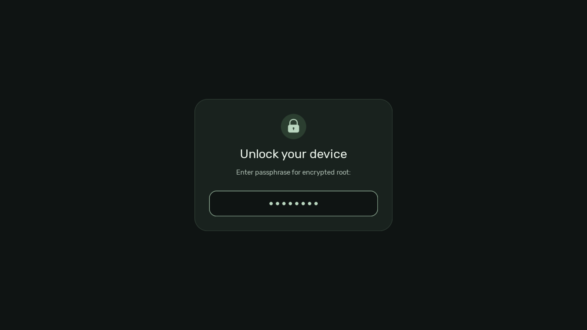
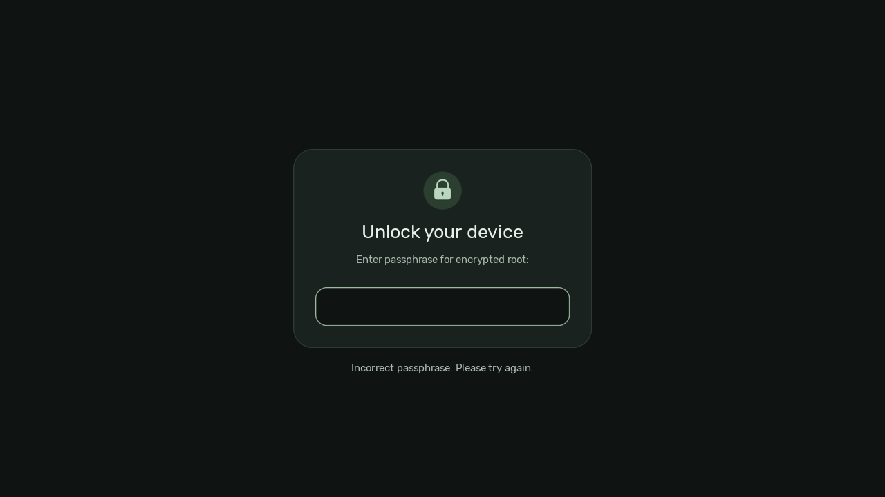
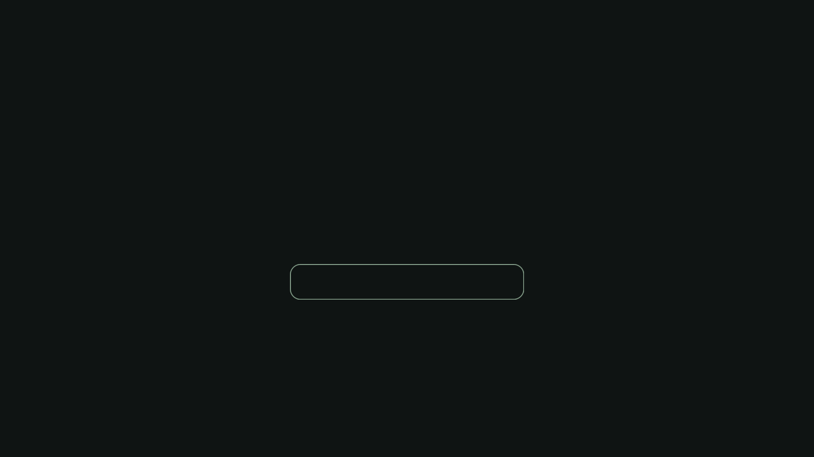
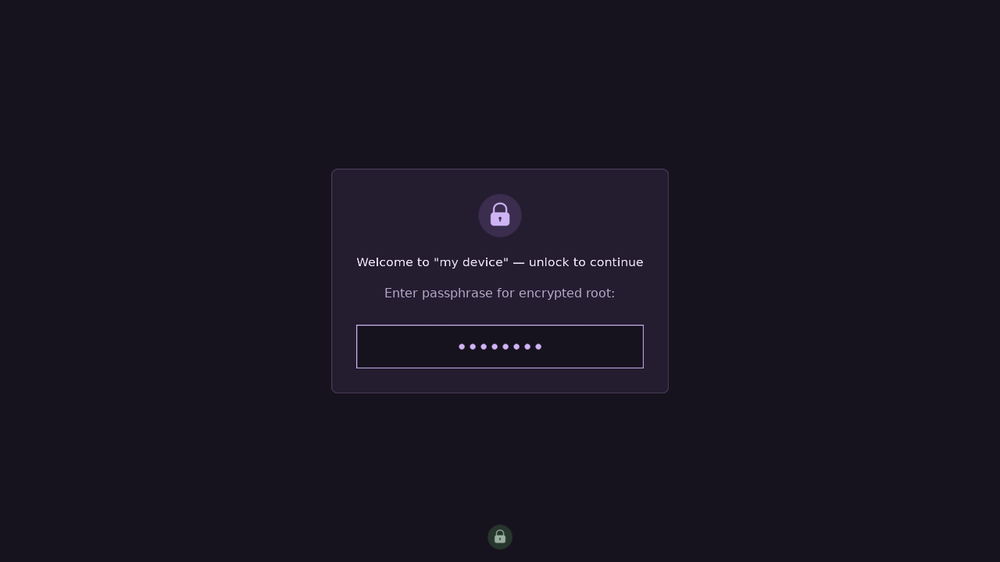

<div align="center">

# Material

**A quieter way to start your day.**

Graphite surfaces · Soft sage accents · Rubik typography

A minimal Plymouth theme for encrypted Linux systems, built with Nix.

[The design](#the-design) · [Install](#install) · [Customize](#customize) · [Development](#development)

</div>



## The design

One center axis. Generous spacing. A soft green accent against deep graphite.
The unlock screen puts the passphrase first, with a geometric lock, a clear
heading and a gently outlined input.

- **Balanced composition.** A 432 × 288 card, 32px side padding and a centered
  368 × 56 password field. Positions follow the display geometry.
- **Rubik throughout.** The font is included in the initrd through the NixOS
  module, so it is available before the disk is unlocked.
- **Clean at the edges.** Rounded assets are drawn at four times their final
  resolution and downsampled. The lock uses geometry, with no emoji dependency.
- **Calm feedback.** Password dots stay centered, with at most 20 visible.
  Long device prompts fit inside the card; retry messages sit below it.
- **A quiet handoff.** The card disappears when Plymouth returns to normal
  mode. A slim progress indicator then follows boot progress.

### Graphite & sage

| | Role | Color |
| --- | --- | --- |
| Background | Deep graphite | `#0f1413` |
| Card | Green charcoal | `#19221e` |
| Outline | Muted forest | `#303e35` |
| Accent | Soft sage | `#b9d6bf` |
| Primary text | Pale mist | `#e8f0e8` |
| Secondary text | Silver sage | `#a8b8ad` |

### Small details, considered

| Password retry | Boot progress |
| --- | --- |
|  |  |

These 1280 × 720 screenshots are rendered from the theme by Plymouth's own
interpreter, text renderer and pixel compositor using simulated display
geometry. They are reproducible build outputs, not photographs of a boot.
The machine-specific footer logo is omitted.

## Install

Add the input to your system flake:

```nix
inputs.plymouth-theme-material = {
  url = "github:krozzzis/plymouth-theme-material";
  inputs.nixpkgs.follows = "nixpkgs";
};
```

Then import the module into your NixOS configuration:

```nix
{ inputs, ... }:
{
  imports = [ inputs.plymouth-theme-material.nixosModules.material ];

  boot.plymouth.enable = true;
  boot.plymouth.theme = "material";
  boot.initrd.systemd.enable = true;
}
```

The module installs the theme package and sets Rubik as the default Plymouth
font. Rebuild your system and reboot to see the updated initrd.

<details>
<summary>Install the package without importing the module</summary>

```nix
{ inputs, pkgs, ... }:
{
  boot.plymouth = {
    enable = true;
    theme = "material";
    font = "${pkgs.rubik}/share/fonts/truetype/Rubik-Regular.ttf";
    themePackages = [
      inputs.plymouth-theme-material.packages.${pkgs.stdenv.hostPlatform.system}.default
    ];
  };

  boot.initrd.systemd.enable = true;
}
```

The font assignment matters: a font name in a Plymouth script does not install
the font into the initrd.

</details>

### Using OSA

[OSA](https://github.com/krozzzis/osa) integrates this package through
`osa.system.plymouth`. Enable that module in your downstream configuration;
OSA handles the theme package and boot font.

## Customize

Keep the defaults you like and override the rest. With the NixOS module:

```nix
{ pkgs, ... }:
{
  boot.plymouth.material.settings = {
    palette = {
      background = "#17131e";
      surface = "#241d30";
      accent = "#cfb4f5";
      inputOutline = "#cfb4f5";
      badge = "#3b2d4e";
    };
    font = "${pkgs.rubik}/share/fonts/truetype/Rubik-Regular.ttf";
    fontFamily = "Rubik";
    title = "Welcome home";
    titleSize = 22;
    textSize = 11;
    logo = ./logo.png;
    logoSize = 64;
    logoOpacity = 0.8;
    cardRadius = 20;
    inputRadius = 12;
    progressWidth = 280;
  };
}
```

The module copies the selected font into the initrd. Set both `font` (a font
file) and `fontFamily` (its internal family name) when changing typefaces.
Your custom logo is bundled into the package and keeps its aspect ratio.



The customization check renders this second variant with a different palette,
font, heading, logo, corner radii and progress dimensions.

### Build your own package

The same settings work without the NixOS module:

```nix
let
  myTheme = inputs.plymouth-theme-material.lib.mkTheme {
    inherit pkgs;
    palette.accent = "#cfb4f5";
    palette.inputOutline = "#cfb4f5";
    cardRadius = 12;
    showLogo = false;
  };
in {
  boot.plymouth.themePackages = [ myTheme ];
  boot.plymouth.font = myTheme.font;
}
```

Or use `packages.${system}.default.override { settings = { ... }; }`.
OSA users can assign the resulting package to `osa.system.plymouth.pkg` in
their downstream denix configuration; OSA uses the package's font automatically.

<details>
<summary>All appearance settings</summary>

| Setting | Default | Meaning / limits |
| --- | --- | --- |
| `palette` | Graphite & sage | Partial overrides; every color is `#rrggbb` |
| `palette.background` | `#0f1413` | Screen background |
| `palette.surface` | `#19221e` | Card fill |
| `palette.outline` | `#303e35` | Card outline and progress track |
| `palette.accent` | `#b9d6bf` | Lock, password dots and progress fill |
| `palette.onSurface` | `#e8f0e8` | Heading |
| `palette.muted` | `#a8b8ad` | Prompts and messages |
| `palette.input` | `#0f1413` | Input fill |
| `palette.inputOutline` | `#9fbea5` | Input outline |
| `palette.badge` | `#2b3e30` | Lock badge fill |
| `font` / `fontFamily` | Rubik Regular / `Rubik` | Font file and Pango family |
| `title` | `Unlock your device` | Heading, fitted to the available space |
| `passwordHint` | `Enter your disk passphrase` | Fallback for an empty system prompt |
| `titleSize` / `textSize` | `20` / `11` | Point sizes; 8–32 / 8–24 |
| `cardRadius` / `inputRadius` | `28` / `16` | Pixels; 0–64 / 0–28 |
| `logo` | `null` | Bundled image, or the system Plymouth logo |
| `showLogo` | `true` | Set `false` to hide the footer logo |
| `logoSize` | `48` | Maximum width and height; 16–96px |
| `logoBottom` | `32` | Bottom margin; 0–64px |
| `logoOpacity` | `0.55` | 0–1 |
| `progressWidth` / `progressHeight` | `320` / `4` | Pixels; 80–432 / 2–12 |

The card's dimensions and spacing stay fixed to preserve alignment. Unknown
settings and invalid values fail at evaluation instead of breaking a boot.

</details>

## Development

```sh
nix build
nix flake check
```

The check runs the actual Plymouth parser and image, text and sprite code.
It exercises password retries, 200-character input, long prompts, repeated
messages, progress clamping and alignment at five resolutions from 640 × 480
to 3840 × 2160. A Rubik-only font configuration keeps rendering reproducible.

Generate the screenshots used above:

```sh
nix build .#checks.x86_64-linux.theme -o result-preview
cp result-preview/{unlock,retry,boot}.png screenshots/
nix build .#checks.x86_64-linux.customization -o result-custom
cp result-custom/unlock.png screenshots/custom.png
```

The package is available for `x86_64-linux` and `aarch64-linux`.
Checks use simulated display geometry; test a real boot for DRM, monitor
scaling and your system's disk-unlock flow.

| File | Purpose |
| --- | --- |
| `theme/material.script` | Layout, typography and Plymouth callbacks |
| `flake.nix` | Packages, builder API and checks |
| `package.nix` | Asset generation and script substitution |
| `options.nix` | Typed appearance settings and defaults |
| `module.nix` | NixOS theme and initrd font integration |
| `check-theme.py` | Native interpreter checks and screenshot rendering |
